**DESAFIO 5**
**CONFIGURACION DE RAID 1**

**1-	Preparación de los discos:**
Se crearon 2 discos virtuales (vdi), de 60Gb y otro de 30Gb.

**2-	Crear particiones de los discos:**
Comando fdisk /dev/sdb para crear nueva partición sobre este disco:
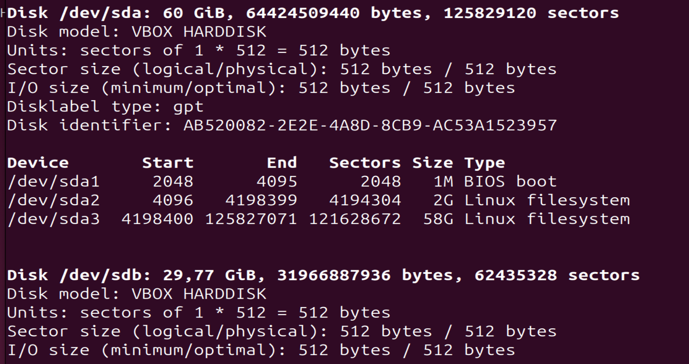
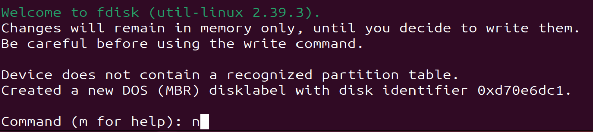

De esa forma se creó la partición con formato Linux, pero debe ser para RAID, por lo que se cambia:

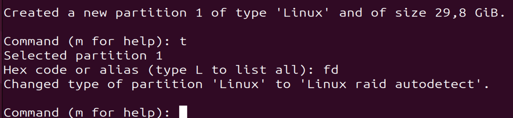

Ahí queda con formato “Linux raid autodetect”.
Con el comando “parted” se va a hacer un “resize” de la partición /dev/sda3, para generar espacio para otra partición con el fin de poder tener otra partición con formato Linux raid.
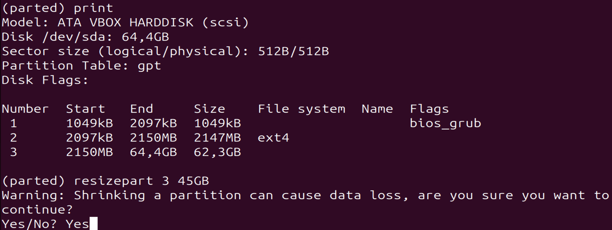

La partición de 65 Gb la bajamos a 40 Gb así usamos lo libre para el RAID.
Creación de nueva partición con el espacio libre:

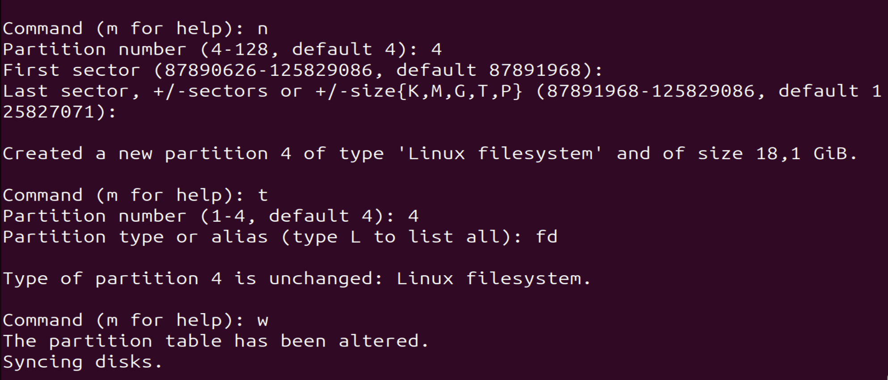

Se cambia a formato Linux RAID:

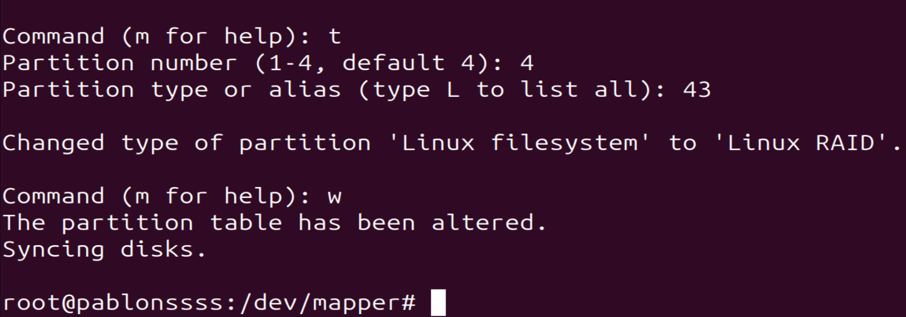

Se ejecuta comando “fdisk -l /dev/sd* y se evidencian las 2 particiones (sda4 y sdb1) para hacer el RAID:

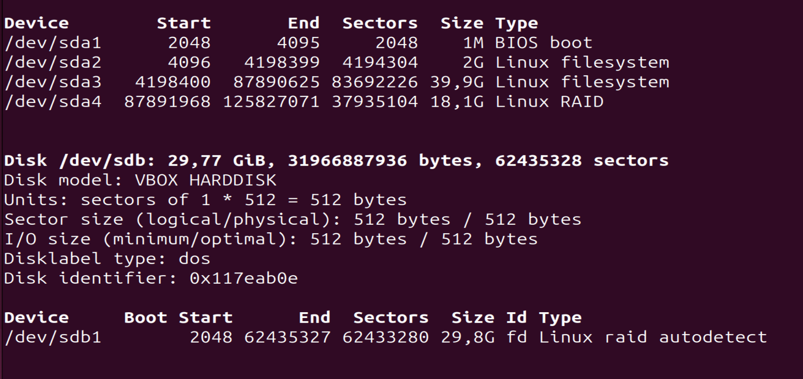

**3-	Instalar madm**
Comando “apt install mdadm” para instalar la herramienta, en este caso ya estaba instalada:

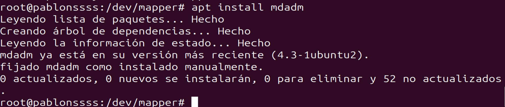

**4-	Crear el RAID 1**
Con el siguiente comando se crea el RAID:
mdadm --create --verbose /dev/md0 --level=1 --raid-devices=2 /dev/sda4 /dev/sdb1

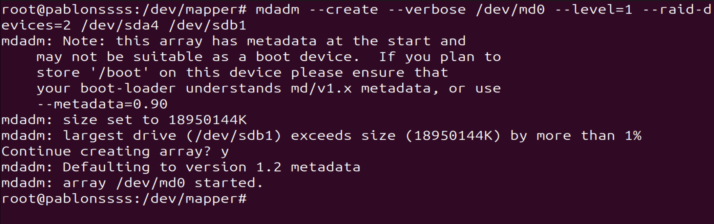

**5-	Verificar el RAID**
Se ejecuta el comando: cat /proc/mdstat

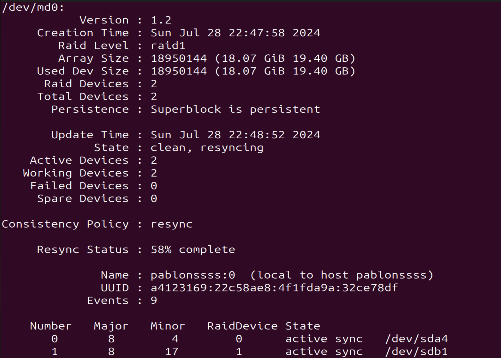

**6-	Configurar el RAID para que se Inicie Automáticamente**
Para que se inicie automáticamente, hay primero que guardar la configuración del RAID en el archivo mdadm.conf
Con el comando “mdadm - -detail - -scan” obtengo la configuración del RAID actual:

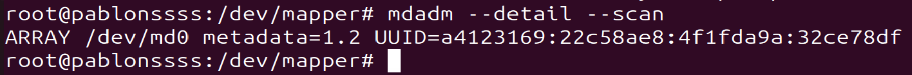
 
Esa línea es la que se debe agregar al archivo “mdadm.conf”, por lo que se ejecuta el siguiente comando: “mdadm - -detail - -scan | tee -a /etc/mdadm/mdadm.conf”

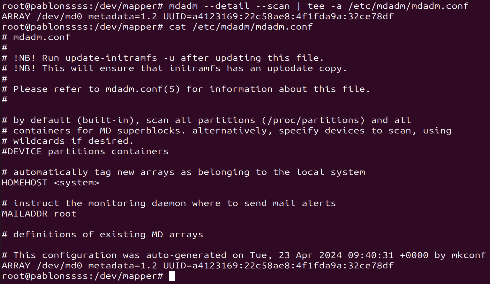

En la imagen anterior se visualiza el archivo y debajo se encuentra la línea del RAID.

---

**Configuración de Volúmenes Lógicos con LVM**

**1.	Instalar LVM**
Comando “apt install lvm2” para instalar el gestor de volúmenes lógicos de Ubuntu.

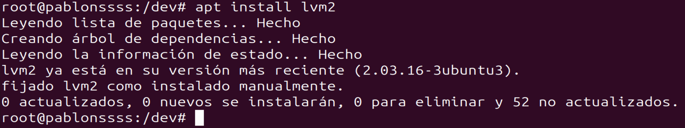

**2.	Crear Volúmenes Físicos (PV)**
Para crear el volumen físico sobre el RAID, se usa el comando “pvcreate”

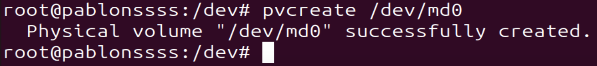

**3.	Crear un Grupo de Volúmenes (VG)**

**a.	Crea un grupo de volúmenes llamado vg_data.**
Para crear un grupo de volúmenes sobre el RAID, se usa el comando “vgcreate vg_data”

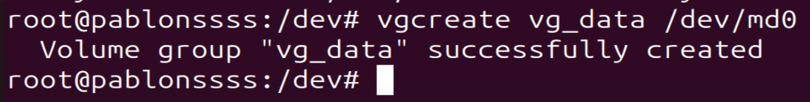

**4.	Crear Volúmenes Lógicos (LV)**

**a.	Crea un volumen lógico llamado lv_data dentro del grupo de volúmenes vg_data.**
Para crear un volumen lógico se usa el comando “lvcreate”, se le pasa como parámetro -n el nombre “lv_data”. Para que use todo el espacio del volumen group “vg_data” se indica con el “-l 100%FREE”

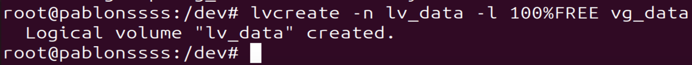

**5.	Formatear y Montar el Volumen Lógico**
    **a.	Formatea el volumen lógico con el sistema de archivos ext4.**
Se digita el comando “mkfs.ext4” a volumen lógico “/dev/vg_data/lv_data” resultante de los pasos anteriores:

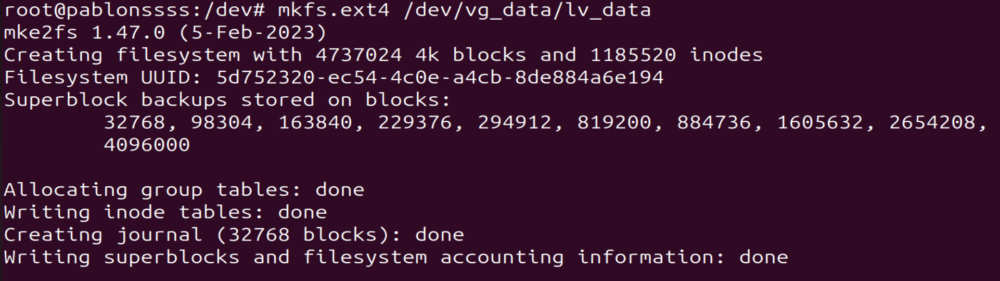

   **b.	Crea un punto de montaje y monta el volumen lógico**
Con “mkdir” se crea el punto para montar el volumen lógico. En este caso en /mnt/lv1
Con el comando “mount /dev/vg_data/lv_data /mnt/lv1” se monta el volumen lógico en el file system , en el punto creado anteriormente.

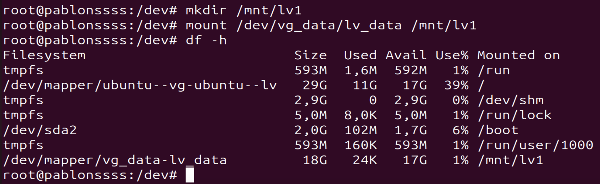

**6.	Configurar el Montaje Automático**
   
   **a.	Añade el volumen lógico a /etc/fstab para que se monte automáticamente al iniciar el sistema**
Comando “blkid” para conocer el UUID, dato que debemos ingresar en el archivo /etc/fstab de Ubuntu para que se monte automáticamente al iniciar el sistema:

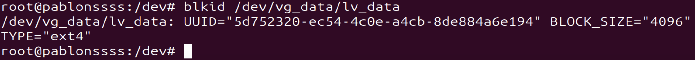

Se ingresa en el archivo /etc/fstab la siguiente línea:
“UUID=5d752320-ec54-4c0e-a4cb-8de884a6e194 /mnt/lv1 ext4 defaults 0 0” 
Y luego de reiniciar el sistema operativo vemos que el volumen lógico levanta automáticamente al iniciar el sistema:

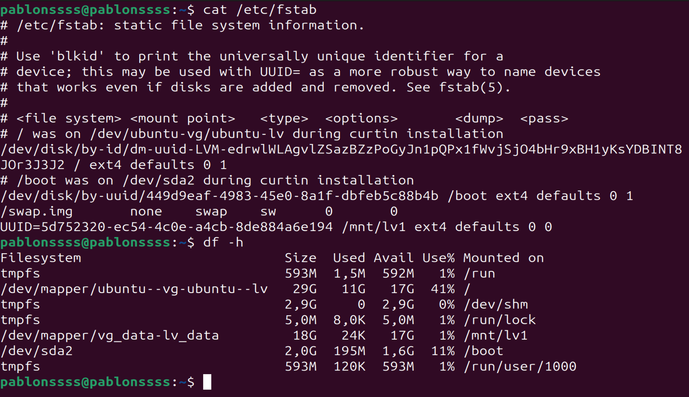

**Verificación y Simulación de Recuperación Ante Fallos**

**1.	Verificar el Volumen Lógico y RAID**
    
**a.	Verifica que el volumen lógico está montado correctamente.**

**b.	Comprueba el estado del RAID.**
Haciendo “df -h” vemos que el volumen lógico está montado en el sistema

Y Para comprobar el estado del RAID debemos ejecutar el siguiente comando:
“mdadm  - - detail /dev/md0”

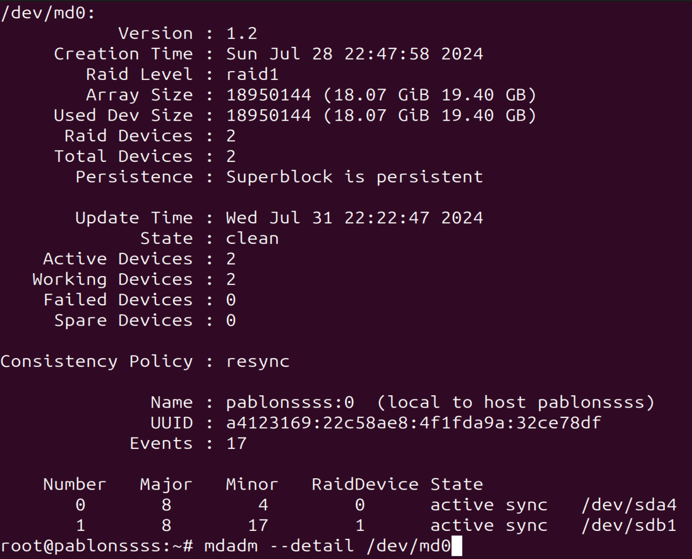

Verificar en este caso como el estado de los dos discos es “active sync”.

**2.	Simular un Fallo de Disco**

**a.	Simula un fallo en uno de los discos del RAID.**

Dentro de la herramienta “mdadm” tenemos el comando “fail” para marcar un disco como fallido. 
En este caso vamos a marcar el “sdb1” como fallido:

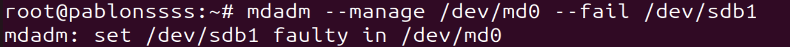

De nuevo revisamos el estado del RAID y vemos que el disco sdb1 está como “faulty”:

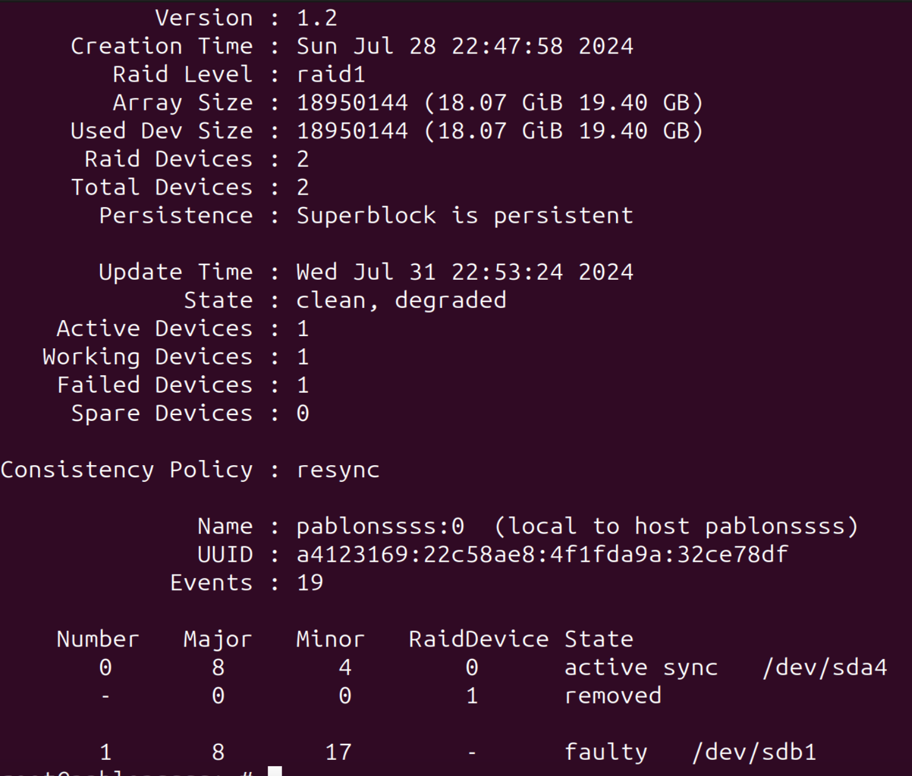

**3.	Reemplazar el Disco Fallido**

   **a.	Supón que reemplazas el disco fallido con uno nuevo (por ejemplo, /dev/sdd).**

   **b.	Crea una nueva partición en el disco nuevo.**

   **c.	Añade el nuevo disco al RAID**

Vamos a agregar a la VM un nuevo disco para reemplazar el fallido, primero agregamos a la VM otro disco SATA, de 9,26 Gb

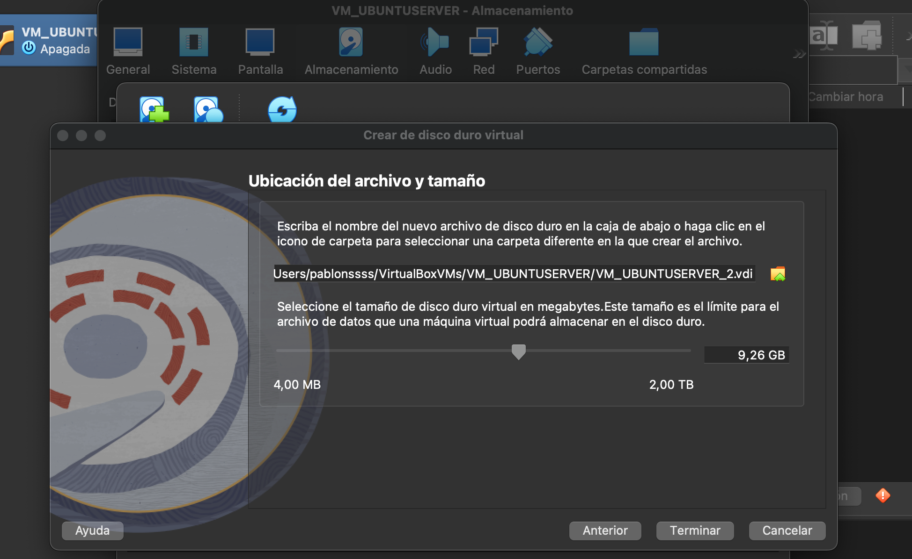
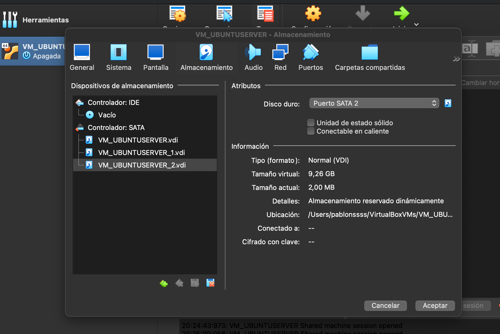

Iniciamos de nuevo el Ubuntu Server y haciendo fdisk -l detectamos que el nuevo disco es /dev/sdc:

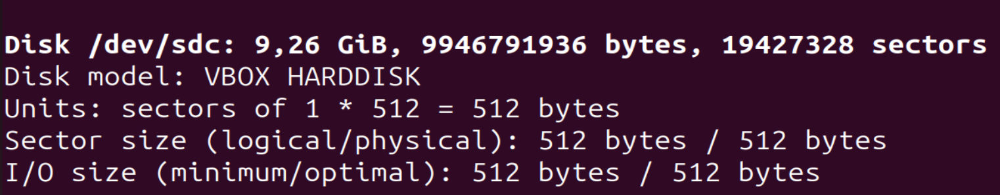

Tenemos que formatearlo, ejecutando los pasos para crear la partición 1 de tipo “Linux raid autodetect”

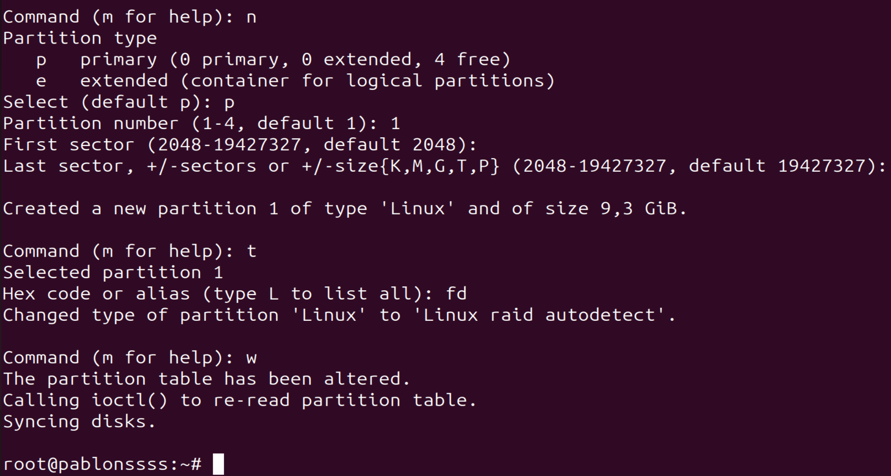

Con esto generamos la partición /dev/sdc1
Ahora vamos a añadir este disco al RAID, con el comando: “mdadm --manage /dev/md0 --add /dev/sdc1”

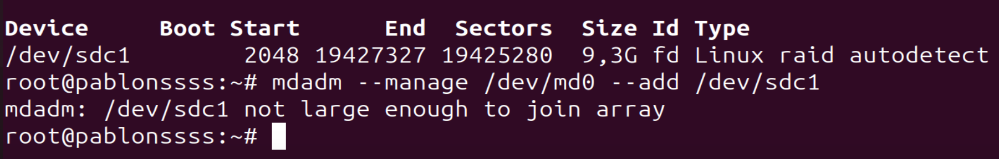

Pero como creamos un disco de 9,26 Gb tenemos el problema de que el disco no tiene el espacio suficiente, por lo que vamos a tener que aumentar el tamaño del nuevo disco a 18Gb que era el RAID o crear otro nuevo.

En VirtualBox se apaga la VM, se decide quitar el disco anterior y crear uno nuevo de 19Gb.

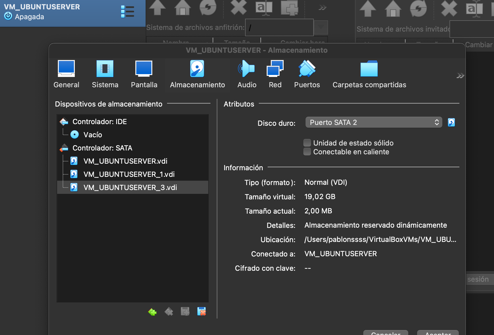

Inicio de nuevo la VM y ejecuto fdisk -l, ahora veo el disco /dev/sdc de 19 Gb, vamos a generar la partición y formatearlo nuevamente:

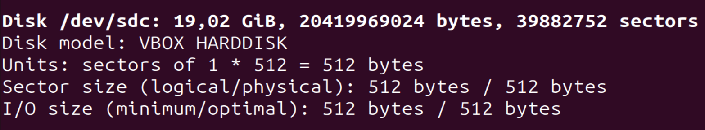

Lo formateamos como partición “Linux raid autodetect”

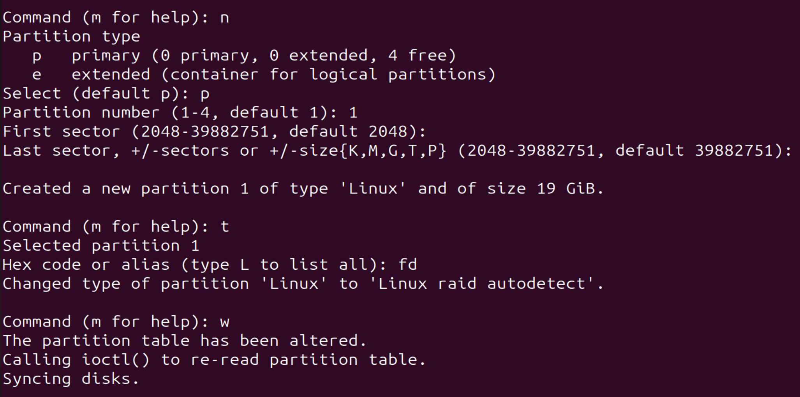

Y con el comando “mdadm –manage /dev/md0 – add /dev/sdc1” lo agregamos al RAID.
Al principio queda en estado “rebuilding”:

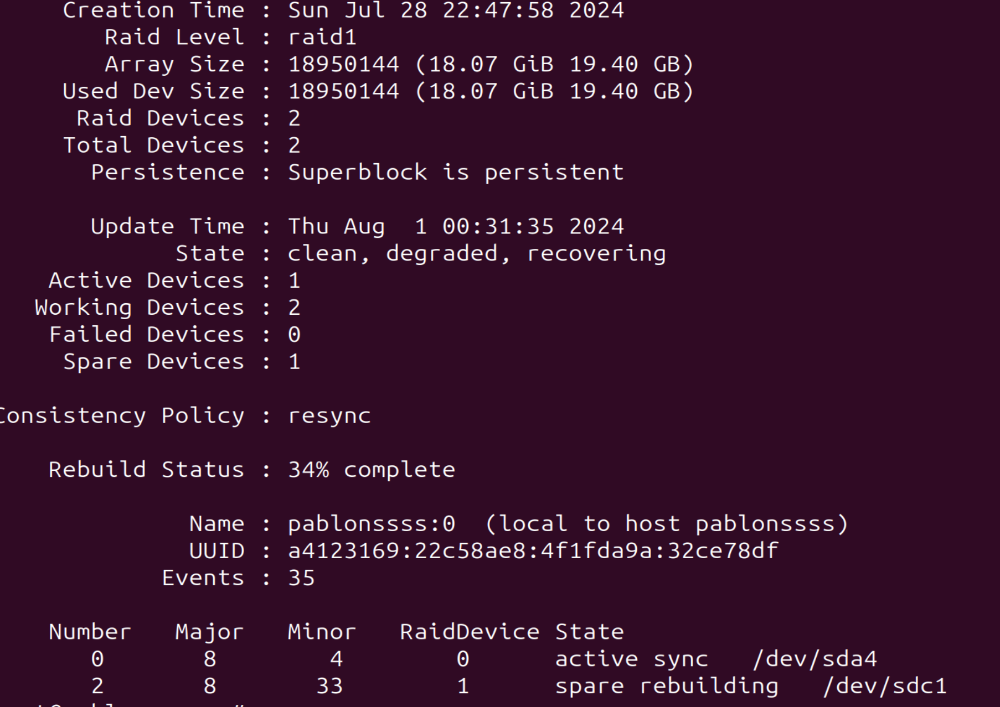

Con el comando “watch cat /proc/mdstat” vemos como esta reconstruyéndose (en este caso se verificó a los minutos y ya había terminado)
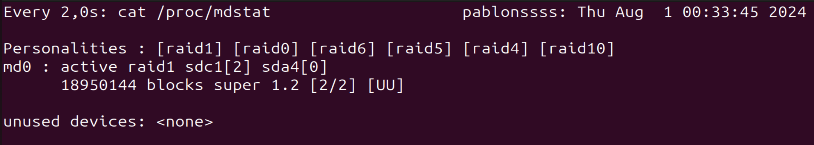

Luego de unos minutos se ve que queda en “advice sync” igual que el sda4:

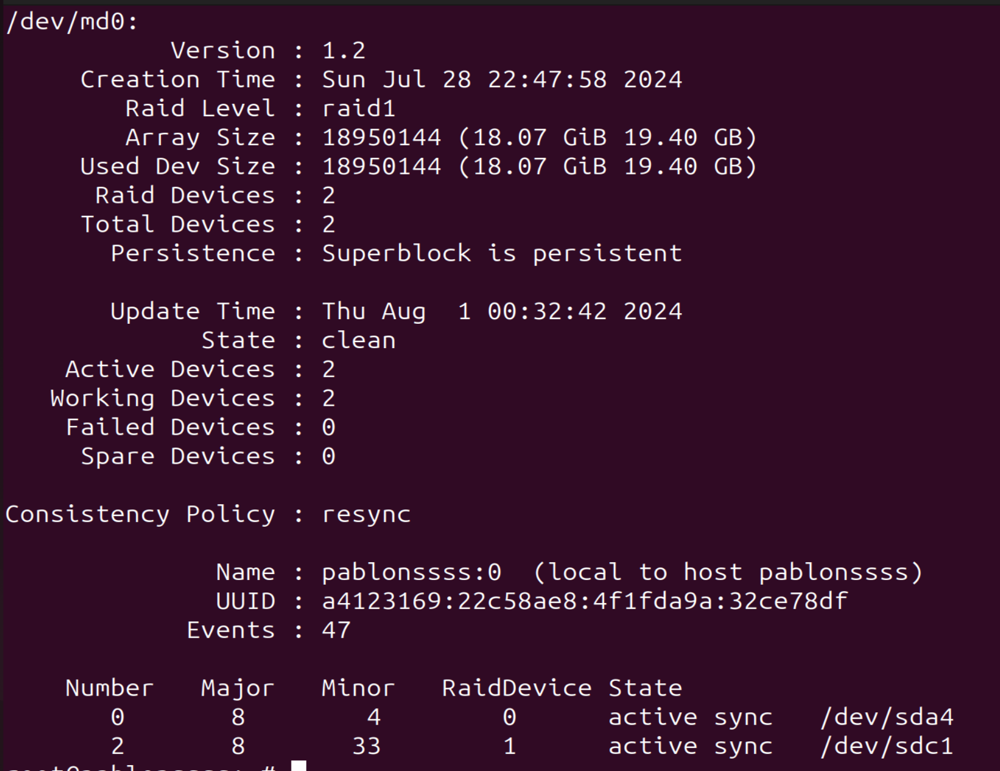

